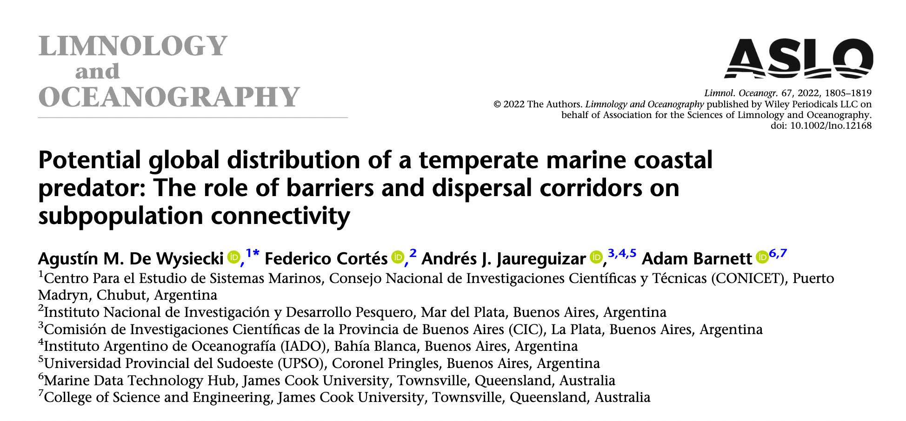

<style>
h2 { color: #4795bf; }
.caption { font-size: 0.4em; }
footer { text-align: right; }
pre {font-size: 0.4em; line-height: 1; padding: 1.5em; box-shadow: none; border-radius: 1em;}
p { font-size: 0.9em; }
</style>

# PacMAN data management

---

## Open science

---


<p class="caption">https://science.gc.ca</p>

<!--
https://www.fosteropenscience.eu/learning/what-is-open-science
https://science.gc.ca/site/science/en/open-science-helping-make-science-accessible-all-canadians
https://www.nature.com/articles/sdata201618
https://www.go-fair.org/fair-principles/fairification-process/
-->

---

### Why data sharing

<style>
    ul { font-size: 0.7em; }
</style>

- Visibility for researchers and donors
- Make research transparent and reproducible
- Create opportunities for collaboration
- Incentive to improve data management and quality
- Efficient use of resources, avoids repetition
- Greater impact and ROI
- Support meta-analysis, discover trends
- Identify knowledge gaps
- Required by funding agencies and journals
---


---


---


---




---


---


---

### The FAIR Guiding Principles for scientific data management and stewardship

> There is an **urgent need to improve the infrastructure supporting the reuse of scholarly data**. A diverse set of stakeholders—representing academia, industry, funding agencies, and scholarly publishers—have come together to design and jointly endorse a concise and measureable set of principles that we refer to as the FAIR Data Principles. The intent is that these may act as a **guideline for those wishing to enhance the reusability of their data holdings**.

---

### Findable

- (meta)data are assigned a **globally unique and persistent identifier**
- data are described with **rich metadata**
- metadata clearly and explicitly include the identifier of the data it describes
- (meta)data are registered or **indexed in a searchable resource**

---

### Accessible

- (meta)data are retrievable by their identifier using a **standardized communications protocol**
- the protocol is open, free, and universally implementable
- the protocol allows for an authentication and authorization procedure, where necessary
- metadata are accessible, even when the data are no longer available

---

### Interoperable

- (meta)data use a formal, accessible, shared, and broadly applicable language for knowledge representation.
- (meta)data use vocabularies that follow FAIR principles
- (meta)data include qualified references to other (meta)data

---

### Reusable

- meta(data) are richly described with a plurality of **accurate and relevant attributes**
- (meta)data are released with a clear and accessible **data usage license**
- (meta)data are associated with **detailed provenance**
- (meta)data meet **domain-relevant community standards**

---

## Data standards

---

### Ecological Metadata Language (EML)

> The Ecological Metadata Language (EML) defines a comprehensive vocabulary and a readable XML markup syntax for documenting research data. EML is a community-maintained specification, and evolves to meet the data documentation needs of researchers who want to openly document, preserve, and share data and outputs.

https://eml.ecoinformatics.org/

---

### Darwin Core

> Darwin Core is a standard maintained by the Darwin Core Maintenance Interest Group. It includes a glossary of terms (in other contexts these might be called properties, elements, fields, columns, attributes, or concepts) intended to facilitate the sharing of information about biological diversity by providing identifiers, labels, and definitions.

https://dwc.tdwg.org/

---

#### Quick reference guide

---


---

#### Text guide

https://dwc.tdwg.org/text/

---


---


https://rs.gbif.org/

---


---

#### Darwin Core terms

---

##### Taxonomy

- `scientificName`
- `scientificNameAuthorship`
- `scientificNameID`: WoRMS LSID
- `taxonRank`
- `identifiedBy`
- `identificationRemarks`
- `identificationQualifier`: e.g. cf., aff.

---

<style scoped>code { font-size: 0.9em;}</style>

```
 scientificName  scientificNameAuthorship  taxonRank                           scientificNameID  identificationQualifier
--------------- ------------------------- ---------- ------------------------------------------ ------------------------
      Abra alba           (W. Wood, 1802)    species  urn:lsid:marinespecies.org:taxname:141433                         
         Lanice            Malmgren, 1866      genus  urn:lsid:marinespecies.org:taxname:129697           cf. conchilega
```

---

##### Time

- `eventDate`
- `verbatimEventDate`
- `year`
- `month`
- `day`

---


---

<style scoped>code { font-size: 1.5em;}</style>

Some ISO 8601 examples:

```
1948-09-13
1973-02-28T15:25:00
1973-02-28T15:25:00Z
2005-08-31T12:11+12
1993-01-26T04:39/1993-01-26T05:48
1993-01/02
1993-01
1993
```

---

##### Location

- `decimalLongitude`
- `decimalLatitude`
- `coordinateUncertaintyInMeters`
- `footprintWKT`
- `geodeticDatum`: EPSG 4326
- `locality`
- `locationID`
- `waterBody`
- `islandGroup`
- `island`
- `country`

---

Some WKT examples:

```
LINESTRING (30 10, 10 30, 40 40)
POLYGON ((30 10, 40 40, 20 40, 10 20, 30 10))
MULTILINESTRING ((10 10, 20 20, 10 40),(40 40, 30 30, 40 20, 30 10))
MULTIPOLYGON (((30 20, 45 40, 10 40, 30 20)),((15 5, 40 10, 10 20, 5 10, 15 5)))
```

---

<style scoped>code { font-size: 0.9em;}</style>

```
 decimalLatitude  decimalLongitude  geodeticDatum  coordinateUncertaintyInMeters                           footprintWKT
---------------- ----------------- -------------- ------------------------------ --------------------------------------
          38.698            20.950      EPSG:4326                          75033  LINESTRING (20.31 39.15, 21.58 38.24)
          42.720            15.228      EPSG:4326                         154338  LINESTRING (16.64 41.80, 13.82 43.64)
```

---


---

##### Identifiers and references

---

##### Terms for AIS


---

- `establishmentMeans`: native, introduced, vagrant, uncertain
- `pathway`: release, escape, transport-contaminant, transport-stowaway, corridor, unaided
- `degreeOfEstablishment`: captive, cultivated, failing, reproducing, established, colonising, invasive

---

#### Dataset structure

---

<style scoped>pre { font-size: 0.37em; }</style>

Occurrence core

```
    occurrenceID  scientificName                           scientificNameID   eventDate  decimalLongitude  decimalLatitude
---------------- --------------- ------------------------------------------ ----------- ----------------- ----------------
 urn:ABC:occ:123       Abra alba  urn:lsid:marinespecies.org:taxname:141433  2022-10-03             3.456           51.987
 urn:ABC:occ:124          Lanice  urn:lsid:marinespecies.org:taxname:129697  2022-10-03             3.456           51.987
```

---

<style scoped>table { font-size: 0.4em; }</style>

Event core

```
           eventID   eventDate  decimalLongitude  decimalLatitude
------------------ ----------- ----------------- ----------------
 urn:ABC:event:789  2022-10-03             3.456           51.987
```

Occurrence extension

```
           eventID     occurrenceID  scientificName                           scientificNameID
------------------ ---------------- --------------- ------------------------------------------
 urn:ABC:event:789  urn:ABC:occ:123       Abra alba  urn:lsid:marinespecies.org:taxname:141433
 urn:ABC:event:789  urn:ABC:occ:124          Lanice  urn:lsid:marinespecies.org:taxname:129697
```

---

<style scoped>table { font-size: 0.4em; }</style>

Event core

```
           eventID     parentEventID   eventDate  decimalLongitude  decimalLatitude
------------------ ----------------- ----------- ----------------- ----------------
  urn:ABC:event:42                                           3.456           51.987
 urn:ABC:event:789  urn:ABC:event:42  2022-10-03                                   
```

Occurrence extension

```
           eventID     occurrenceID  scientificName                           scientificNameID
------------------ ---------------- --------------- ------------------------------------------
 urn:ABC:event:789  urn:ABC:occ:123       Abra alba  urn:lsid:marinespecies.org:taxname:141433
 urn:ABC:event:789  urn:ABC:occ:124          Lanice  urn:lsid:marinespecies.org:taxname:129697
```

---

<style scoped>table { font-size: 0.4em;}</style>

Event core

```
           eventID   eventDate  decimalLongitude  decimalLatitude
------------------ ----------- ----------------- ----------------
 urn:ABC:event:789  2022-10-03             3.456           51.987
```

Occurrence extension

```
           eventID     occurrenceID  scientificName                           scientificNameID
------------------ ---------------- --------------- ------------------------------------------
 urn:ABC:event:789  urn:ABC:occ:123       Abra alba  urn:lsid:marinespecies.org:taxname:141433
 urn:ABC:event:789  urn:ABC:occ:124          Lanice  urn:lsid:marinespecies.org:taxname:129697
```

MeasurementOrFact extension

```
           eventID  measurementType  measurementValue  measurementUnit
------------------ ---------------- ----------------- ----------------
 urn:ABC:event:789      temperature                17        degrees C
 urn:ABC:event:789         salinity                31              psu
```

---


---

ExtendedMeasurementOrFact extension

https://rs.gbif.org/extension/obis/extended_measurement_or_fact.xml

- measurementID
- **occurrenceID**
- measurementType
- **measurementTypeID**
- meadurementValue
- **measurementValueID**
- measurementUnit
- **measurementUnitID**

---

#### DNADerivedData extension


https://docs.gbif.org/publishing-dna-derived-data/1.0/en/

---


---

<style scoped>table { font-size: 0.5em; }</style>

| Field name | Example |
| --- | --- |
| DNA_sequence | TCTATCCTCAATTATAGGTCA |
| sop | https://dx.doi.org/10.17504/protocols.io.pa7dihn |
| target_gene | 16S rRNA |
| target_subfragment | V6 |
| pcr_primer_forward | GGACTACHVGGGTWTCTAAT |
| pcr_primer_reverse | GGACTACHVGGGTWTCTAAT |
| pcr_primer_name_forward | jgLCO1490 |
| pcr_primer_name_reverse | jgHCO2198 |
| pcr_primer_reference | https://doi.org/10.1186/1742-9994-10-34 |
| env_broad_scale | forest biome [ENVO:01000174] |
| env_local_scale | litter layer [ENVO:01000338] |
| lib_layout | Paired |
| seq_meth | Illumina HiSeq 1500 |
| otu_seq_comp_appr |"blastn;2.6.0+;e-value cutoff: 0.001" |
| otu_db | "NCBI Viral RefSeq;83", "UNITE;8.2" |
---

#### Audubon Core extension


---

<style scoped>table { font-size: 0.5em; }</style>

| Field name | Example |
| --- | --- |
| provider | http://morphbank.net |
| rights | http://creativecommons.org/licenses/by/3.0/legalcode |
| owner | https://orcid.org/0000-0002-4236-0384 |
| description | Epistenia coeruleata: head frontal view |
| associatedSpecimenReference | http://www.morphbank.net/135231 |
| captureDevice | digital camera, UV pass filter |
| accessURI | http://images.morphbank.net/?id=135233 |
| format | http://mediatypes.appspot.com/jpeg |
| PixelXDimension | 2000 |
| startTime | 15 |
| endTime | 23 |
| xFrac | 0.2 |
| widthFrac | 0.1 |

---

### Vocabularies

---

#### BODC P01 Parameter Usage Vocabulary

https://github.com/nvs-vocabs/P01

> The BODC PUV is a controlled vocabulary for labelling scientific variables in databases and data files. It is a collection of unique and persistent identifiers attached to structurally logical labels and textual definitions. It is a SKOS (Simple Knowledge Organisation System) controlled vocabulary. This means that its structure is compliant with SKOS, a W3C recommendation for the representation of knowledge in a format understandable to computers.

---

**The property or attribute** (S06)  
of **an object of interest** (S25, S27, S29)  
in relation to (S02)  
**an environmental matrix** (S26)  
by **a method** (S03, S04, S05)

---


---

#### World Register of Marine Species

https://www.marinespecies.org/

https://www.marinespecies.org/introduced/

---


---


---

## OBIS data publishing

---


---


---


---


---


---


---

## PacMAN data management

---


---


---

## OBIS data access