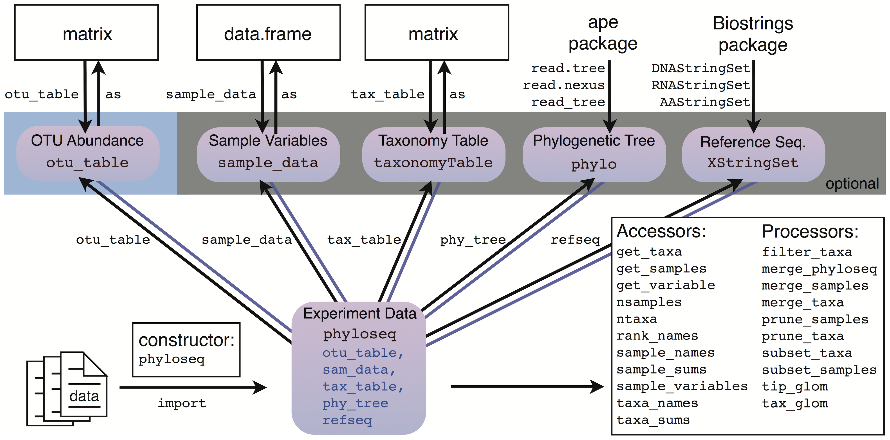

<style>
img { box-shadow: none !important; border: 0px !important; }
</style>

## Resources

- https://deneflab.github.io/MicrobeMiseq/demos/mothur_2_phyloseq.html
- https://joey711.github.io/phyloseq/plot_ordination-examples.html
- https://david-barnett.github.io/microViz/articles/web-only/ordination.html
- https://www.gdc-docs.ethz.ch/MDA/handouts/MDA20_PhyloseqFormation_Mahendra_Mariadassou.pdf
- http://rstudio-pubs-static.s3.amazonaws.com/266780_cac4994322494658904507a7606b1dd8.html

## Running this notebook

To run run this notebook in its entirety, clone or download the [iobis/pacman-pipeline-training repository](https://github.com/iobis/pacman-pipeline-training). The notebook can be found in the `datasets/rey/analysis` directory.

## Importing data

The PacMAN pipeline exports results as a `phyloseq` object which can be imported into R for analysis. This is how `phyloseq` objects are structured:



Read the `phyloseq` object and verify that we have a OTU table, a sample table, and a taxonomy table. A phylogenetic tree has not been calculated so that slot is empty.

```{r message=FALSE, warning=FALSE}
physeq <- readRDS("../results_noblast/phyloseq_object.rds")

physeq
```

While we can access these tables individually (for example using `physeq@sam_data`), the phyloseq package also has a function `psmelt()` to convert the `phyloseq` object into a single large data frame:

```{r message=FALSE, warning=FALSE}
library(dplyr)

df <- psmelt(physeq) %>%
  # convert empty strings to NA across all character columns
  mutate_if(is.character, ~na_if(., "")) %>%
  # convert to tibble for prettier printing
  as_tibble()

df
```

## Exploratory data analysis

### Abundance by phylum

Let's first determine which are the most abundant phyla across all samples. We will use this information to bin the less abundant phyla into a category `Other` for simplifying some of our graphics.

```{r message=FALSE, warning=FALSE}
stats_phyla <- df %>%
  group_by(phylum) %>%
  summarize(abundance = sum(Abundance)) %>%
  arrange(desc(abundance))

top_phyla <- head(na.omit(stats_phyla$phylum), 8)
top_phyla
```

Now create a color scale:

```{r message=FALSE, warning=FALSE}
phylum_colors <- RColorBrewer::brewer.pal(9, "Spectral")
names(phylum_colors) <- c(top_phyla, "Other")
phylum_colors
```

And add a new column with binned phyla:

```{r message=FALSE, warning=FALSE}
df <- df %>%
  mutate(phylum_binned = ifelse(is.na(phylum) | phylum %in% top_phyla, phylum, "Other")) %>%
  mutate(phylum_binned = factor(phylum_binned, levels = c(top_phyla, "Other")))
```

### Abundance by sample type and phylum

First list the abundance by phylum and sample type:

```{r message=FALSE, warning=FALSE}
library(tidyr)

stats_type_phylum <- df %>%
  group_by(eventRemarks, phylum) %>%
  summarize(abundance = sum(Abundance))

spread(stats_type_phylum, eventRemarks, abundance) %>%
  mutate(total = `settlement plates` + `filtered water`) %>%
  arrange(desc(total)) %>%
  knitr::kable()
```

Now create a graph using the binned phyla:

```{r message=FALSE, warning=FALSE}
library(ggplot2)

stats_type_phylum <- df %>%
  # calculate total abundance by sample type
  group_by(eventRemarks) %>%
  mutate(abundance = Abundance / sum(Abundance)) %>%
  group_by(eventRemarks, phylum_binned) %>%
  summarize(abundance = sum(abundance))
  
ggplot() +
  geom_bar(data = stats_type_phylum, aes(y = eventRemarks, fill = phylum_binned, x = abundance), stat = "identity") +
  scale_fill_manual(values = phylum_colors, na.value = "#eeeeee") +
  theme_minimal()
```

### Abundance (reads) by sample and phylum

```{r message=FALSE, warning=FALSE}
stats_sample_phylum <- df %>%
  # calculate total abundance by sample type
  group_by(Sample) %>%
  mutate(relative_abundance = Abundance / sum(Abundance)) %>%
  group_by(Sample, eventRemarks, phylum_binned) %>%
  summarize(relative_abundance = sum(relative_abundance), abundance = sum(Abundance))
```

Absolute reads abundance:

```{r message=FALSE, warning=FALSE}
ggplot() +
  geom_bar(data = stats_sample_phylum, aes(y = Sample, fill = phylum_binned, x = abundance), stat = "identity") +
  scale_fill_manual(values = phylum_colors, na.value = "#eeeeee") +
  theme_minimal() +
  theme(panel.grid.major.y = element_blank(), panel.grid.minor.y = element_blank())
```

Relative reads abundance:

```{r message=FALSE, warning=FALSE}
ggplot() +
  geom_bar(data = stats_sample_phylum, aes(y = Sample, fill = phylum_binned, x = relative_abundance), stat = "identity") +
  scale_fill_manual(values = phylum_colors, na.value = "#eeeeee") +
  theme_minimal() +
  theme(panel.grid.major.y = element_blank(), panel.grid.minor.y = element_blank())
```

### Most abundant species

Let's list the species with the highest relative abundance across all samples:

```{r message=FALSE, warning=FALSE}
top_species <- df %>%
  filter(!is.na(species)) %>%
  group_by(species) %>%
  summarize(abundance = sum(Abundance)) %>%
  arrange(desc(abundance)) %>%
  head(20)

top_species %>% knitr::kable()
```

For the most abundant species, plot the abundance by sample:

```{r message=FALSE, warning=FALSE}
stats <- df %>%
  filter(species %in% top_species$species) %>%
  group_by(species, eventRemarks, Sample) %>%
  summarize(abundance = sum(Abundance))

ggplot() +
  geom_jitter(data = stats, aes(y = species, x = abundance, color = eventRemarks), pch = 21, height = 0.1, width = 0) +
  scale_color_brewer(palette = "Set1") +
  theme_minimal()
```

## Invasive species

In this section we will check our results against the World Register of Introduced Marine Species (WRiMS). The repository contains a CSV file containing the LSIDs for all species in WRiMS.

```{r message=FALSE, warning=FALSE}
wrims_lsids <- read.csv("wrims_lsids.csv")

invasives <- df %>%
  filter(lsid %in% wrims_lsids$lsid)

invasives %>%
  group_by(phylum, species) %>%
  summarize(abundance = sum(Abundance)) %>%
  arrange(desc(abundance)) %>%
  rmarkdown::paged_table()
```

## ASV accumulation curves

To do.

## Alpha and beta diversity

To do.

## Multidimensional scaling

```{r message=FALSE, warning=FALSE}
ord <- ordinate(physeq = physeq, method = "PCoA", distance = "bray")

plot_ordination(physeq = physeq, ordination = ord, type = "samples", color = "eventRemarks", shape = "locality") +
  geom_point(aes(color = eventRemarks), alpha = 1, size = 4) +
  geom_text(aes(label = materialSampleID), alpha = 0.7, size = 3, vjust = 2) +
  stat_ellipse(aes(group = eventRemarks)) +
  scale_color_brewer(palette = "Set1") +
  scale_shape(solid = TRUE) +
  theme_classic()

# todo: Canonical analysis of principal coordinates
```