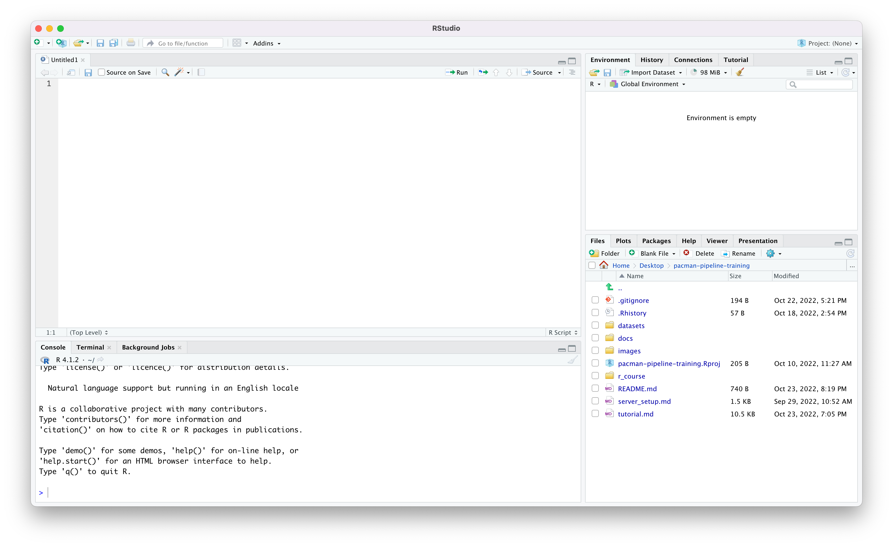

## Install R (Windows)

This is a quick introduction to the R programming language and the RStudio development environment, to be able to do some exploratory data analysis on the results of the PacMAN bioinformatics pipeline.

Install the latest R from <https://ftp.belnet.be/mirror/CRAN/bin/windows/base/>.

## Install Rstudio (Windows)

Install Rstudio Desktop from <https://ftp.belnet.be/mirror/CRAN/bin/windows/base/>.

Open RStudio and create a new R script:



Selections or individual lines of R code in the editor panel can be executed using the `Run` button at the top of the editor, or by pressing `Ctrl`+`Enter`. Results will be visible in the Console panel below. You can also type commands directly into the Console. On the top right we have the Environment panel and below that the Files panel.

In the Files panel, create a new working directory using the `New Folder` button. Go into the directory and select `More` > `Set As Working Directory`.

## R basics

### Assignment

Assign values to objects with the `<-` operator. To type this operator in one go, use `Alt`+`-`.

```{r message=FALSE, warning=FALSE}
weight <- 32
color <- "yellow"
edible <- TRUE
```

### Comments

Add comments in your code by typing a `#`. Anything to the right of this will be ignored by the interpreter.

```{r message=FALSE, warning=FALSE}
# changing the weight
weight <- 45 # used to be 32
```

### Types

The objects we just created have different types:

```{r message=FALSE, warning=FALSE, collapse=TRUE}
class(weight)
class(color)
class(edible)
```

### Math

Now let's try some math:

```{r message=FALSE, warning=FALSE, collapse=TRUE}
n <- 5
total_weight <- weight * n
total_weight
```

### Functions

Functions are blocks of code that optionally take one or more inputs (called arguments) and can return a value. The `class()` function we just used earlier takes any object as argument and returns a class name.

A function can be defined like this:

```{r message=FALSE, warning=FALSE, collapse=TRUE}
surface_area <- function(width, height) {
  return(width * height)
}

surface_area(3, 2)
```

If you use argument names, their order can be changed:

```{r message=FALSE, warning=FALSE, collapse=TRUE}
surface_area(height = 2, width = 3)
```

Function arguments can have default value:

```{r message=FALSE, warning=FALSE, collapse=TRUE}
surface_area <- function(width, height = 8) {
  return(width * height)
}

surface_area(3)
```

### Accessing documentation

To get more information about a function, use `?`.

```{r message=FALSE, warning=FALSE, collapse=TRUE}
?class
```

### Vectors

Vectors are sequences of elements which have the same type. Values can be combined into a vector using the `c()` function.

```{r message=FALSE, warning=FALSE, collapse=TRUE}
numbers <- c(1, 2, 3)
numbers
length(numbers)
```

Sequences of numbers can be generated using `:`:

```{r message=FALSE, warning=FALSE, collapse=TRUE}
x <- 1:10
x
```

We can also do math with vectors:

```{r message=FALSE, warning=FALSE, collapse=TRUE}
x ^ 2
```

Sequences with smaller increments can be created using `seq()`:

```{r message=FALSE, warning=FALSE, collapse=TRUE}
x <- seq(0, 2 * pi, by = 0.1)
y <- sin(x)

x
y
```

### Subsetting vectors

### Data frames

Data frames are table like structures. They can be created from vectors:

```{r message=FALSE, warning=FALSE, collapse=TRUE}
mountains <- data.frame(
  name = c("Mount Everest", "K2", "Kangchenjunga", "Lhotse"),
  height = c(8848, 8611, 8586, 8516),
  ascent = c(1953, 1954, 1955, 1956)
)

mountains
```

### Subsetting data frames

### Missing data

### Packages

Packages are reusable collections of code developed by the community. Packages can be installed from different sources, including The Comprehensive R Archive Network (CRAN) and GitHub. To install a package from CRAN, use `install.packages()`:

```{r message=FALSE, warning=FALSE, collapse=TRUE, eval=FALSE}
install.packages("remotes")
```

Packages can be loaded using `library()`:

```{r message=FALSE, warning=FALSE, collapse=TRUE}
library(remotes)
```

Alternatively, you can use the `::` operator to select a function from a particular package:

```{r message=FALSE, warning=FALSE, collapse=TRUE, eval=FALSE}
remotes::available_packages()
```

Packages hosted on GitHub can be installed using the `remotes` package:

```{r message=FALSE, warning=FALSE, collapse=TRUE, eval=FALSE}
remotes::install_github("iobis/robis")
```

## Base graphics

R has built-in graphics capabilities.

```{r message=FALSE, warning=FALSE, collapse=TRUE}
plot(x, y)
hist(rnorm(10000), breaks = 50)
```

## ggplot2 graphics

ggplot2 is an alternative graphics framework, based on Hadley Wickham's [Layered Grammar of Graphics](http://vita.had.co.nz/papers/layered-grammar.html) which builds on [The Grammar of Graphics](https://link.springer.com/book/10.1007/0-387-28695-0) by Leland Wilkinson.

In ggplot2, graphics layers are composed of the following elements: data, mapping between variables and aesthetics, geometric objects, statistical transformations, scales, the coordinate system, and facets.

In practice, this works like this:

```{r message=FALSE, warning=FALSE, collapse=TRUE}
library(ggplot2)

ggplot(data = data.frame(x, y)) +
  geom_line(aes(x = x, y = y)) +
  geom_point(aes(x = x, y = y, color = x, size = y))
```

This is a rather basic graph, but [the possibilities are endless](https://exts.ggplot2.tidyverse.org/gallery/).

## Input and output

## The Tidyverse

## Style guides

Consistent code style makes code easier to read an collaborate on. If you are unsure about your R style, check the following style guides:

- http://adv-r.had.co.nz/Style.html
- https://google.github.io/styleguide/Rguide.html
- https://style.tidyverse.org/
