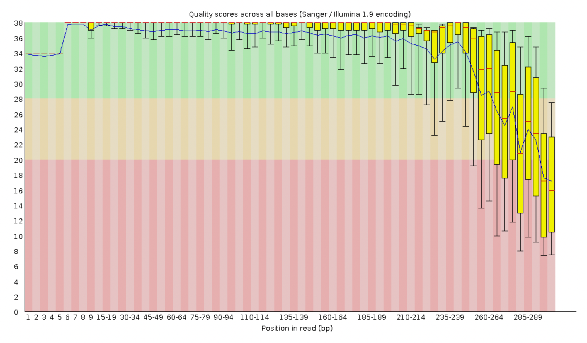
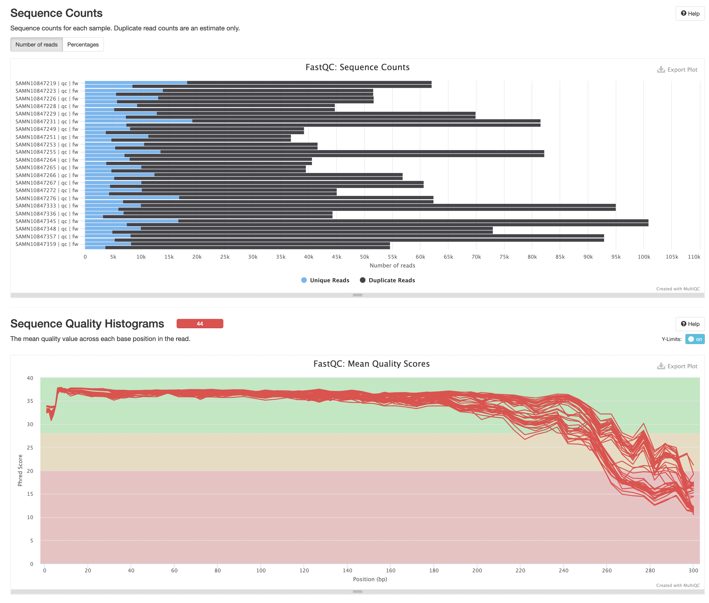
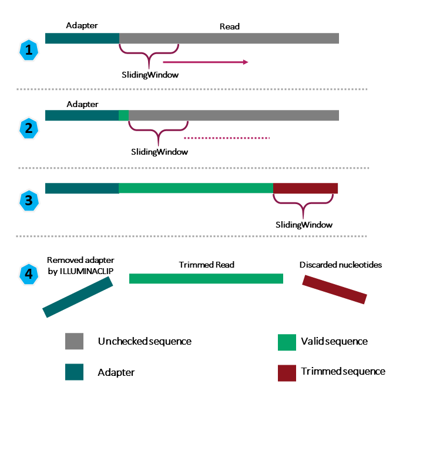
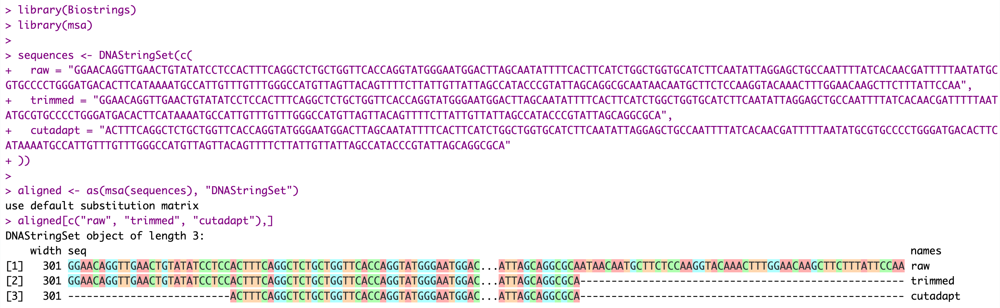
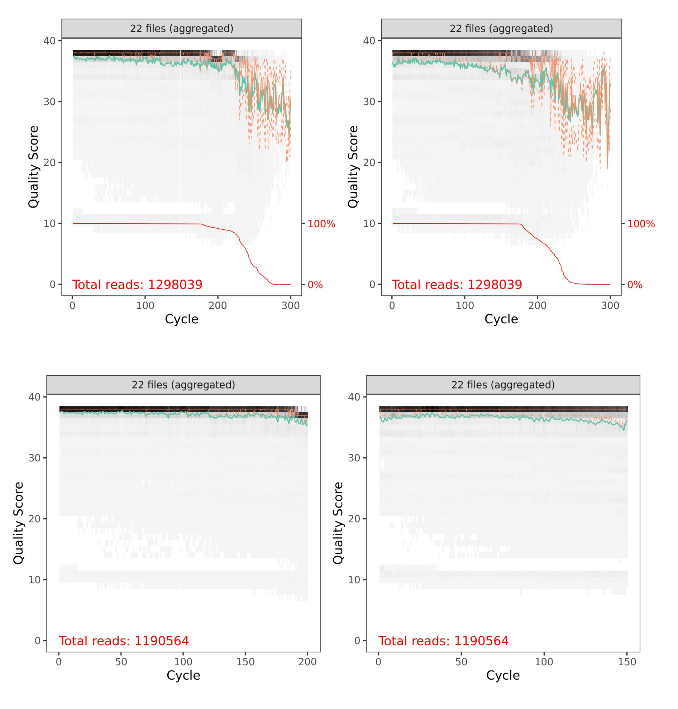
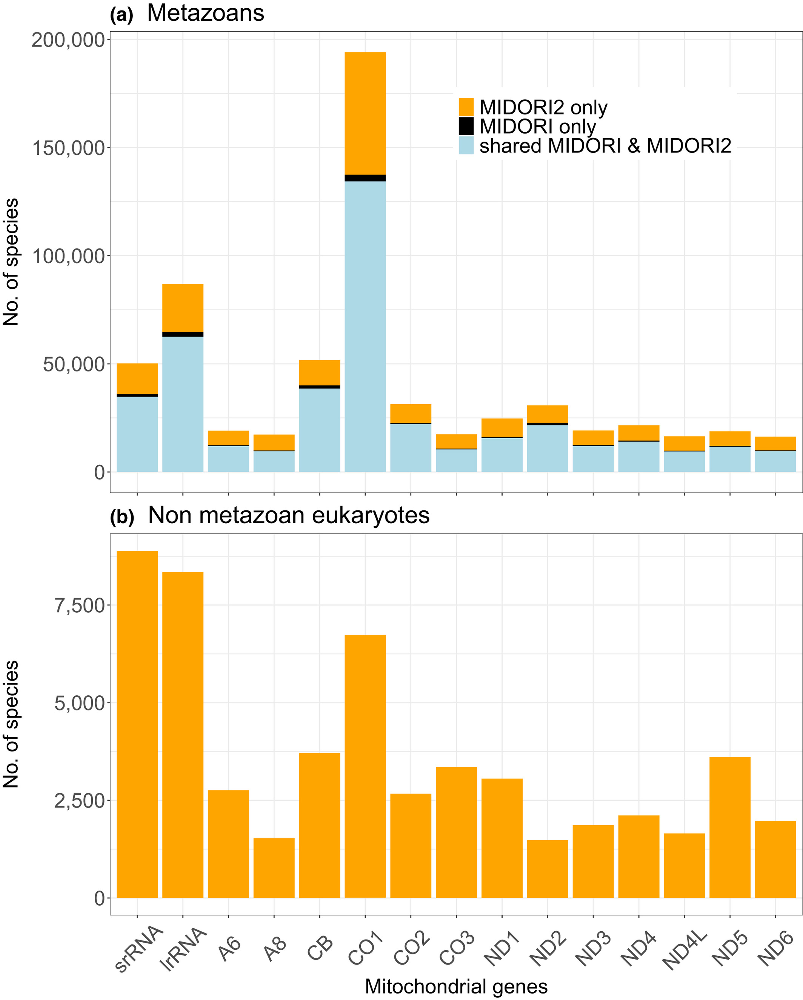

# PacMAN bioinformatics pipeline tutorial

The PacMAN bioinformatics pipeline has been developed as an open source project at https://github.com/iobis/PacMAN-pipeline. The pipeline takes raw CO1 reads as input and converts them to Darwin Core aligned species occurrence tables ready for ingestion into OBIS.

In this tutorial we will use the PacMAN pipeline to analyze sequence data from Rey et al. 2020 ([Considerations for metabarcoding-based port biological baseline surveys aimed at marine nonindigenous species monitoring and risk assessments](https://doi.org/10.1002/ece3.6071)). In this study, zooplankton, water, sediment, and biofouling samples have been collected from four sites in the port of Bilbao (Spain) for metabarcoding. The protocols used to collect and analyze the samples are similar to those used in the PacMAN project.

Before diving into the data and the pipeline software, let's first take a look at the individual steps that make up the pipeline.

## Pipeline steps

A schematic overview of the PacMAN pipeline and the files it generates can be found [here](https://github.com/iobis/PacMAN-pipeline/raw/master/documentation/diagram.png).

### Quality control

[FastQC](https://www.bioinformatics.babraham.ac.uk/projects/fastqc/) is used to perform an initial quality control step of the raw sequence data. It allows us to spot any obvious quality issues in the source data at a glance. FastQC generates a quality report for each sample which includes a graph of the [Phred quality score](https://en.wikipedia.org/wiki/Phred_quality_score) as a function of base pair position. Phred quality scores can be interpreted as follows:

|Phred Quality Score|Probability of incorrect base call|Base call accuracy|
|--- |--- |--- |
|10|1 in 10|90%|
|20|1 in 100|99%|
|30|1 in 1000|99.9%|
|40|1 in 10,000|99.99%|
|50|1 in 100,000|99.999%|
|60|1 in 1,000,000|99.9999%|

Next we use [MultiQC](https://multiqc.info/) to aggerate the quality information generated by FastQC. The MultiQC report includes a graph showing the mean quality score for each sample.

### Trimming

In this step we use [Trimmomatic](https://github.com/usadellab/Trimmomatic) to trim our raw reads. This includes the removal of adapters which have been added during library preparation (parameter `ILLUMINACLIP`), and of bases at the start (parameter `LEADING`) and the end (parameter `TRAILING`) of the reads which are of insufficient quality. The appropriate adapter sequences need to be provided in a FASTA file. Trimmomatic will also perform "adaptive quality trimming" (parameter `MAXINFO`).

  

Image from Metagenomics for Software Carpentry[^1].

### Removing primer sequences

[Cutadapt](https://github.com/marcelm/cutadapt) is used to remove the primer sequences. Forward and reverse primer sequences need to be configured in the config file.

Let's take a look at one of the reads from the example dataset as it is processed with Trimmomatic and Cutadapt. Notice how the first step has trimmed the low quality nucleotides at the end of the sequence, while the primer sequence `GGWACWGGWTGAACWGTWTAYCCYCC` has been remove from the start of the read:

  

### DADA2

In this step, we will use the [DADA2](https://benjjneb.github.io/dada2/) software package to infer exact amplicon sequence variants from our paired end reads. DADA2 models sequencing errors introduced during Illumina sequencing to be able to differentiate between errors and actual biological variation[^2]. This approach offers a number of advantages over the classic approach of deriving Operational Taxonomic Units (OTUs), such as a finer taxonomic resolution.

#### Filtering and trimming

Although we have already cleaned up our reads a bit, we also use DADA2 [filterAndTrim](https://rdrr.io/bioc/dada2/man/filterAndTrim.html) to truncate the reads at a specified length or quality threshold, and filter out reads which do not meet the required length after trimming.

DADA2 will generate sample based and aggregate quality profiles. Let's take a look at the aggregate quality profile of the paired reads before and after trimming (note the shorter sequence length and decrease in the total number of reads):

  

#### ASV inference

In the next step, ASVs are inferred from the cleaned up raw reads. This involves training the error model, dereplication, sample inference, and merging the forward and reverse reads to obtain the full sequences. This step also removes chimeric sequences (artifact sequences formed from two or more biological sequences, for example during PCR).

## Taxonomic annotation

In this step we assign taxonomy by aligning our sequences with sequences in the reference tool. This will be done using [Bowtie2](https://bowtie-bio.sourceforge.net/bowtie2/index.shtml).

### Bowtie2

In the PacMAN pipeline, a Bowtie2 database can either be provided, or provisioned by a dedicated build step. In this case we build a database based on the [MIDORI2 reference database](http://www.reference-midori.info/)[^3]. MIDORI2 is built from GenBank and contains curated sequences of thirteen protein-coding and two ribosomal RNA mitochondrial genes. MIDORI2 covers all eukaryotes, including fungi, green algae and land plants, other multicellular algal groups, and diverse protist lineages. The database is updated approximately every two months with version numbers corresponding to each new GenBank release.

  

Figure from Leray et al. 2022[^3].

By default, the pipeline is configured so that Bowtie2 uses the `--very-sensitive` preset (slow but more accurate) and finds up to 100 distinct alignments. The alignments are exported as SAM files.

### BLCA

In this step, a Bayesian Least Common Ancestor (BLCA) algorithm is used to infer taxonomy from the best distinct alignments provided by Bowtie2.

An additional filter step removes any assignments that have a likelihood level below the configured cutoff, to ensure reliable assigments.

### BLAST and LCA

In this optional step, BLASTn is used against a local copy of the full NCBI nt (nucleotide) database to attempt to further annotate unclassified sequences.

[BASTA](https://github.com/timkahlke/BASTA) is used to assign taxonomies based on the Last Common Ancestor (LCA) of the best hits.

### Darwin Core

...

Results are also exported as a phyloseq object.

## Running the pipeline

To do.

## Analysis of the pipeline results

To do.

[^1]: Nelly Sélem Mojica; Diego Garfias Gallegos; Claudia Zirión Martínez; Jesús Abraham Avelar Rivas; Aaron Jaime Espinosa; Abel Lovaco Flores; Tania Vanessa Arellano Fernandez (2022, Jan). Metagenomics for Software Carpentry lesson, Jan 2022. Zenodo. <https://doi.org/10.5281/zenodo.4285900>

[^2]: Callahan, B., McMurdie, P., Rosen, M. et al. DADA2: High-resolution sample inference from Illumina amplicon data. Nat Methods 13, 581–583 (2016). <https://doi.org/10.1038/nmeth.3869>

[^3]: Leray, M., Knowlton, N., Machida R. J. 2022. MIDORI2: A collection of quality controlled, preformatted, and regularly updated reference databases for taxonomic assignment of eukaryotic mitochondrial sequences. Environmental DNA Volume 4, Issue 4, Pages 894-907. <https://doi.org/10.1002/edn3.303>
